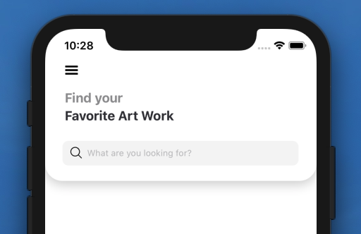
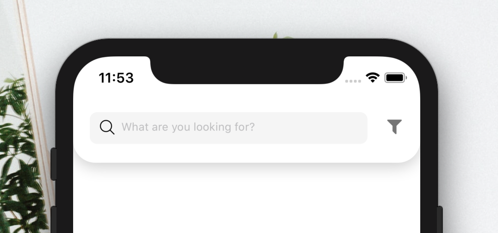

[](https://github.com/WrathChaos/react-native-header-search-bar)

[](https://github.com/WrathChaos/react-native-header-search-bar)

[](https://www.npmjs.com/package/react-native-header-search-bar)
[](https://www.npmjs.com/package/react-native-header-search-bar)

[](https://opensource.org/licenses/MIT)
[](https://github.com/prettier/prettier)

<p align="center">
  
  
</p>

## Installation

Add the dependency:

### React Native:

```ruby
npm i react-native-header-search-bar
```

## Peer Dependencies

###### IMPORTANT! You need install them.

```js
"react": ">= 16.x.x",
"react-native": ">= 0.55.x",
"react-native-androw": ">= 0.0.33",
"react-native-vector-icons": ">= 6.6.0",
"react-native-safe-area-context": ">= 0.6.1",
"react-native-dynamic-vector-icons": ">= 0.2.1",
"@freakycoder/react-native-helpers": ">= 0.0.21"
```

# Component Options

- HeaderSearchBar
- HeaderClassicSearchBar

## Import

```js
import {
  HeaderSearchBar,
  HeaderClassicSearchBar
} from "react-native-header-search-bar";
```

# HeaderSearchBar Usage

```jsx
<HeaderSearchBar onChangeText={text => console.log(text)} />
```

# HeaderClassicSearchBar Usage

```jsx
<HeaderClassicSearchBar onChangeText={text => console.log(text)} />
```

# Configuration - Props

## Main Props

| Property             |   Type    |      Default      | Description                                                |
| -------------------- | :-------: | :---------------: | ---------------------------------------------------------- |
| backgroundColor      |   color   |       #fff        | change the background color                                |
| shadowColor          |   color   |       #000        | change the main shadow color                               |
| firstTitle           |  string   |     Find your     | set the first title itself                                 |
| secondTitle          |  string   | Favorite Art Work | set the second title itself                                |
| firstTitleColor      |   color   |      #959597      | change the first title's text color                        |
| secondTitleColor     |   color   |      #34343b      | change the second title's text color                       |
| firstTitleFontSize   |  number   |        18         | change the first title font size                           |
| secondTitleFontSize  |  number   |        18         | change the second title font size                          |
| iconComponent        | component |  hamburger icon   | set your own component instead of hamburger icon component |
| onPressHamburgerIcon | function  |       null        | set your own function when hamburger icon is on pressed    |

## SearchBox Props

| Property                 |   Type    |          Default          | Description                                           |
| ------------------------ | :-------: | :-----------------------: | ----------------------------------------------------- |
| iconName                 |  string   |          search           | set the icon name                                     |
| iconType                 |  string   |         EvilIcons         | set the icon type                                     |
| iconSize                 |  number   |            25             | set the icon size                                     |
| iconColor                |   color   |           #000            | set the icon color                                    |
| onChangeText             | function  |         function          | set your own logic for changing text                  |
| value                    |  string   |         undefined         | set the value for search box's text input             |
| searchBoxText            |  string   | What are you looking for? | set the search box's text                             |
| searchBoxTextStyle       |   style   |          default          | set your own style for text input's style             |
| searchBoxOnPress         | function  |         function          | set your own logic when tapping the search box itself |
| searchBoxWidth           |  number   |            95%            | change the search box's width                         |
| searchBoxBorderRadius    |  number   |             8             | change the search box's border radius                 |
| searchBoxBackgroundColor |   color   |          #f5f5f5          | change the search box's background color              |
| iconComponent            | component |           Icon            | set your own icon component instead of Icon           |
| disableTextInput         |  boolean  |           false           | disable or enable the text input itself               |

## Future Plans

- [x] ~~LICENSE~~
- [x] ~~Header Classic Search Bar Component~~
- [ ] Write an article about the lib on Medium

## Inspiration

Header Search Bar Component is designed by: [Jawadur Rahman](https://www.instagram.com/p/B3RSEG9APnH/)

## Author

FreakyCoder, kurayogun@gmail.com

## License

React Native Header Search Bar is available under the MIT license. See the LICENSE file for more info.
